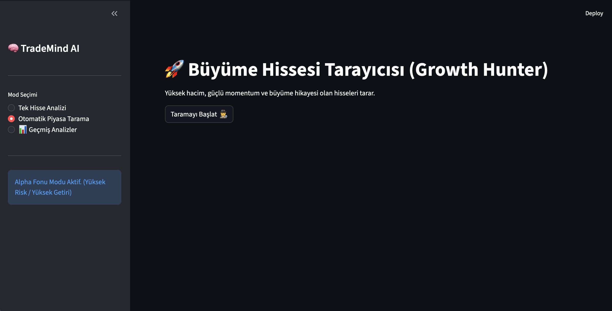
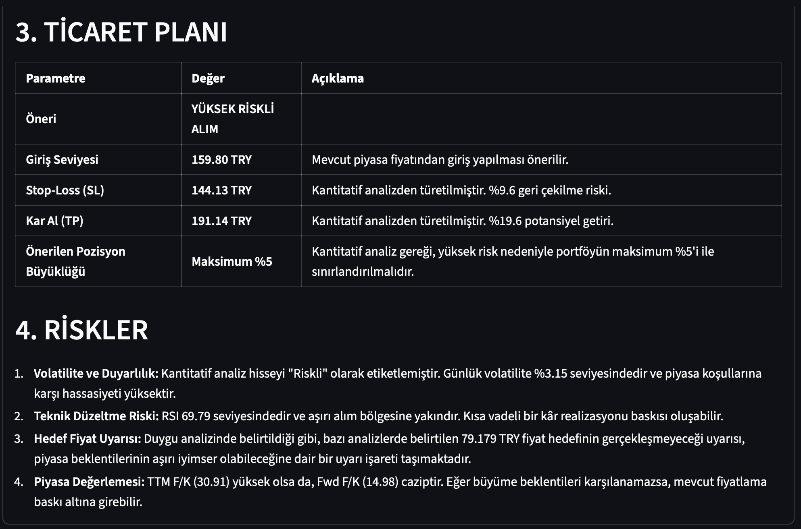
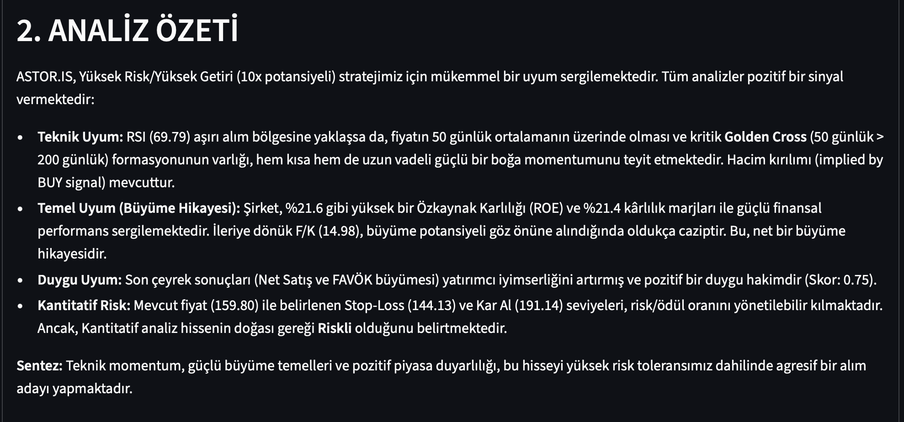

# 🧠 TradeMind AI - Intelligent Stock Analysis System

TradeMind AI is an advanced, agentic AI system designed to analyze stock markets using a multi-agent architecture. It combines Technical, Fundamental, Sentiment, and Quantitative analysis to provide comprehensive investment reports and trade signals.

## 📸 Screenshots

### 📊 Interactive Dashboard


### 📝 Detailed Analysis Report


### 📈 Technical Graphs


## 🚀 Features

- **Multi-Agent Architecture**:
  - **Technical Agent**: Analyzes price action, moving averages (SMA_50, SMA_200), RSI, and Golden Crosses.
  - **Fundamental Agent**: Acts as a **Venture Capitalist**, evaluating financial health, P/E ratios, and growth potential.
  - **Sentiment Agent**: Scrapes news and measures market sentiment using AI.
  - **Quant Agent**: Calculates risk metrics like ATR, Stop-Loss, Take-Profit, and Portfolio Allocation.
  - **Consensus Agent**: Acts as an **Alpha Fund Manager**, synthesizing all reports into a final "Investment Committee Decision".

- **Modes**:
  1.  **Single Stock Analysis**: Deep dive into a specific ticker (e.g., THYAO.IS).
  2.  **Growth Hunter (Scanner)**: Scans ~50 stocks (BIST 30 + Growth/Energy) for high-potential breakouts (Volume, Momentum, Volatility).
  3.  **Trade Memory**: Automatically saves analysis reports to a local SQLite database for historical review.

- **AI Powered**: Powered by Google's **Gemini 1.5 Flash / Flash-Lite** models for fast and cost-effective reasoning.
- **Interactive UI**: Built with **Streamlit** for a modern, dark-mode friendly dashboard.

## 🛠️ Installation

1.  **Clone the Repository**
    ```bash
    git clone https://github.com/yourusername/TradeMind.git
    cd TradeMind
    ```

2.  **Create Virtual Environment**
    ```bash
    python3 -m venv venv
    source venv/bin/activate
    ```

3.  **Install Dependencies**
    ```bash
    pip install -r requirements.txt
    ```

4.  **Configure Environment**
    Create a `.env` file in the root directory:
    ```env
    GOOGLE_API_KEY=your_gemini_api_key_here
    TAVILY_API_KEY=your_tavily_api_key_here  # Optional: For generic search
    ```

## 🖥️ Usage

### Web Interface (Recommended)
Run the Streamlit app:
```bash
streamlit run app.py
```
- **Market Scanner**: Click "Taramayı Başlat" to find top growth stocks.
- **History**: View past analyses in the "Geçmiş Analizler" tab.

### CLI Mode
Run the command-line interface:
```bash
python main.py
```

## 📂 Project Structure

```
TradeMind/
├── src/
│   ├── agents/          # AI Agents (Technical, Fundamental, Sentiment, Consensus, Quant)
│   ├── tools/           # Components (Scanner, Market Data, Database)
│   └── graph/           # LangGraph Workflow Definitions
├── app.py               # Streamlit Dashboard Entry Point
├── main.py              # CLI Entry Point
├── requirements.txt     # Python Dependencies
├── trade_history.db     # Local SQLite Database (Auto-created)
└── .env                 # API Keys
```

## ⚠️ Disclaimer

**This project is for educational and experimental purposes only.**
The content generated by TradeMind AI does not constitute financial advice. Always do your own research (DYOR) before making investment decisions. The "High Risk" and "Alpha" personas are simulated behaviors.
